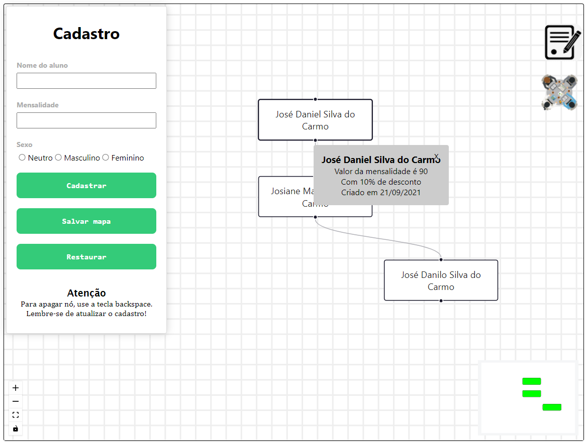
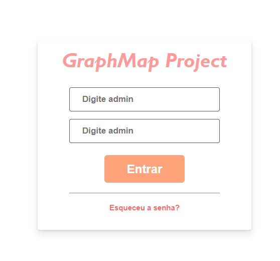
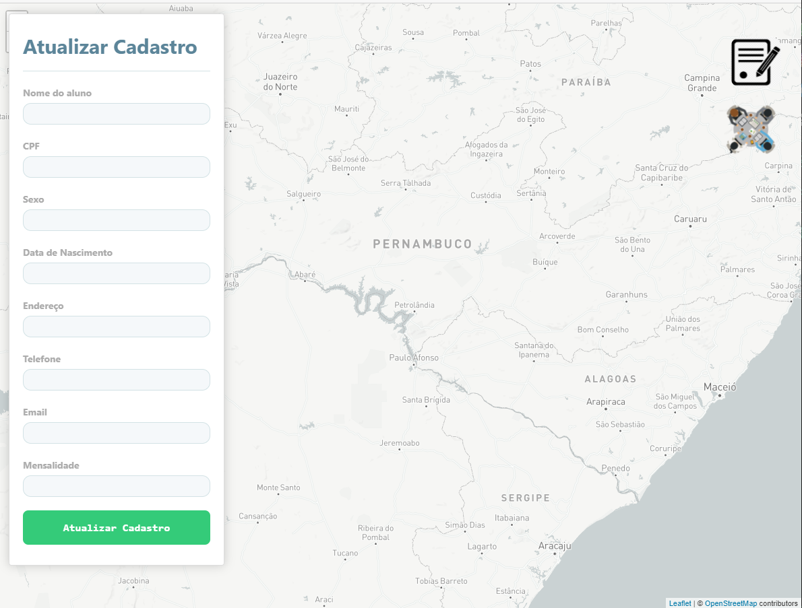

<h4 align="center">
  🚀 GraphMap - TreeGraph Project
</h4>

Projeto individual com objetivo de concretizar o saber.



## Tecnologias

- Node.JS
- React
- React Leaflet (Mapa)
- React Flow (Grafo)



## Configurado em:

- Cors
- Express
- Mongoose
- Axios



## Instalação de depedências

Configure o MongoDB e atualize a string de conexão com seu `User:Senha` no arquivo `index.js`.  

**Backend**
```bash
cd backend
yarn
yarn dev
```

**Frontend**:
```bash
cd web
yarn
yarn start
```